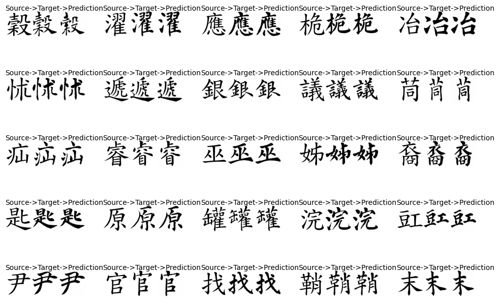

# CalliGAN - Style and structure-aware Chinese Calligraphy Generator
CalliGAN - Tensorflow 2 Implementation (AI for Content Creation Workshop CVPR 2020)    

## Intruduction
This is the implementation of paper "CalliGAN - Style and structure-aware Chinese Calligraphy Generator" accepted by AI for Content Creation Workshop CVPR 2020.
The purpose of this paper is to generate Chinese calligraphy characters.

## Environments
Tensorflow: 2.9.1  
Keras: 2.9.0  
Datasets: Custom, please refer to the "datasets" folder or [書法教學資料庫](http://163.20.160.14/~word/modules/myalbum/).  

## References
Paper: [CalliGAN: Style and Structure-aware Chinese Calligraphy Character Generator](https://arxiv.org/abs/2005.12500)  
Code: [An official implementation](https://github.com/JeanWU/CalliGAN)   
Rewrite: [Rewrite-tf-keras](https://github.com/huangxinping/Rewrite-tf-keras) - An unofficial implementation, which is also to generate Chinese calligraphy cahracters    
XingZi: [XingZi-tf-keras](https://github.com/huangxinping/XingZi-tf-keras) - An unofficial implementation, which is also to generate Chinese calligraphy cahracters    
Typography Research Collection: https://hackmd.io/@ishengfang/B1BZCZpPX?type=view

## Disclaimer
An unofficail implementation, please refer to the original paper.  
